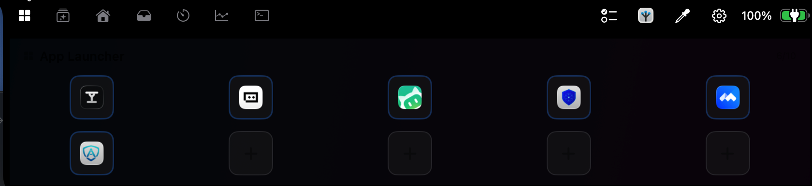
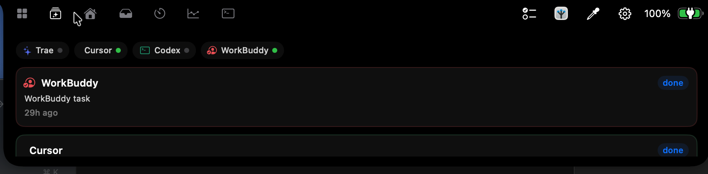
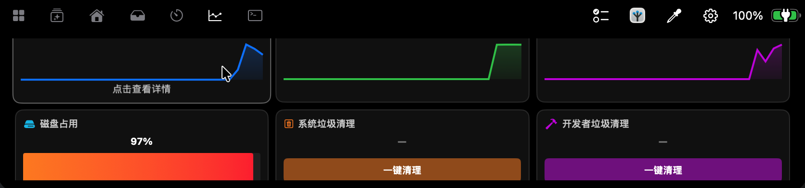

# brew.app（眉梢）

| | |
|---|---|
| 中文名 | **眉梢** |
| 英文 / 产品名 | **brew** / `brew.app` |
| 仓库 | https://github.com/zhyr/brew |

> 基于 Atoll (DynamicIsland) 二次开发的 macOS 刘海屏增强工具，面向 IT 开发者定制。  
> 遵循 GPL v3 协议，源代码公开，保留原作者版权声明。

## 项目定位

**眉梢（brew.app）** 是 **[LLM-based Software Development Kit Suite](https://github.com/zhyr/LLM-based-Software-Devlopment-Kit-Suite)**（HaxiTAG 工具链）的成员应用之一：在刘海屏统一调度启动器、Agent 状态、磁盘维护与媒体控制，并与同系桌面工具协同。

权威总览：Kit Suite [`TOOLCHAIN.md`](https://github.com/zhyr/LLM-based-Software-Devlopment-Kit-Suite/blob/main/TOOLCHAIN.md)。

| 中文名 | 英文 / 产品 | 仓库 | 角色 |
| ------ | ----------- | ---- | ---- |
| **眉梢** | brew.app（本仓库） | [zhyr/brew](https://github.com/zhyr/brew) | 刘海屏中枢：应用启动器、AI agent 状态监控、磁盘维护、媒体控制 |
| **栖痕** | Perch | [zhyr/Perch](https://github.com/zhyr/Perch) | 菜单栏剪贴板 / 提示词记录树；眉梢通过 tab 一键唤起 |
| **疏引** | Vestige | [zhyr/RightMenu](https://github.com/zhyr/RightMenu) | Finder 全局复制路径与文件名、批量复制、打开终端 |
| — | Al-exporter | [zhyr/Al-exporter](https://github.com/zhyr/Al-exporter) | AI agent 安装路径与进程识别规范；眉梢据此监控 Trae/Cursor/Codex/WorkBuddy |
| — | Coding Scaffold | [Kit Suite / coding-scaffold](https://github.com/zhyr/LLM-based-Software-Devlopment-Kit-Suite/tree/main/coding-scaffold) | IDE 内 Compose prompt + context |

```text
Kit Suite（Compose / disk_maintenance）
        │
        ├── 眉梢 brew.app ──刘海中枢──► 栖痕 Perch（记录回喂）
        │         ▲
        │         └── Al-exporter（Agent 路径约定）
        │
        └── 疏引 Vestige ──Finder 取径──► 粘贴进对话 / 栖痕 / 终端
```

典型协作：眉梢在刘海统一调度；栖痕承载即时记录；疏引从 Finder 取径；Al-exporter 规范 agent 识别；Scaffold 在 IDE 内组 prompt。

## 核心功能一览

| 截图 | 功能 |
| ---- | ---- |
|  | **App Launcher**：10 槽位自定义应用快捷方式，刘海一键启动 |
|  | **Agents / LLM 任务监控**：Trae / Cursor / Codex / WorkBuddy 的任务状态与运行卡片 |
|  | **磁盘与系统监控**：磁盘占用 statcard、系统/开发者垃圾清理 |
|  | **TaskNote 任务清单 + Perch 按钮**：刘海右上一行内协同 |

### TaskNote 任务清单（内置）

刘海内的轻量任务清单（quick "remember to do X"），独立于栖痕的完整笔记：

- **存储**：按天一个 JSON 文件（`YYYY-MM-DD.json`），勾选只翻转 `completed` 标记、永不删记录，仅显式删除才移除数据
- **iCloud Drive 同步**（默认开启）：数据存放于 iCloud 容器 `iCloud.com.brew.app` 的 `Documents/task-note/`，同一 Apple ID 的多台 Mac 自动共享
  - 写入经 `NSFileCoordinator(.forMerging)` 协调，读取经 `.forReading`，与 Finder / FileProvider 编辑不冲突
  - `NSMetadataQuery` 监听远端变更，另一台 Mac 上的修改自动拉取；启动/切换时按任务 `id` 去重合并
  - 设置中可关闭同步（数据回落到 `~/Documents/brew/task-note/`，本地保留不删）；登录/登出 iCloud 运行中即时切换，迁移失败自动保底重试
  - 同步状态徽标实时显示：已同步 / 未登录 / 本地模式 / 下载中
- **与 Perch 的分工**：TaskNote 是"待办勾选清单"；Perch 是"内容记录与 LLM 上下文回喂"（见下）

### Perch（栖痕）— LLM 上下文记事本

[栖痕 Perch](https://github.com/zhyr/Perch) 是独立的菜单栏记录树 app，在本工具链中承担 **LLM 上下文记事本** 角色：剪贴板历史、提示词片段、会话上下文的分层记录，需要时把记录"回喂"给 Agent / 对话 / 终端。眉梢与其协同：

- 安装栖痕后，刘海 header 右侧出现 **栖痕图标按钮**（带真实 app 图标），点击即唤起/前置栖痕面板（`LSUIElement` 激活走 `NSRunningApplication.activate`，冷启动后 AppleScript 兜底前置）
- 同时 Notes tab 变为 Perch tab，tab 与 header 按钮两条路径均可触达
- 未安装时按钮隐藏、tab 回退为 Clipboard，无副作用
- 配合疏引（Vestige）从 Finder 取得的路径，可直接粘贴进栖痕条目作为上下文素材

## 项目来源与协议

### 上游仓库克隆与引用声明

本项目克隆自 **Atoll (DynamicIsland)** 仓库（`https://github.com/Ebullioscopic/Atoll`），并在此基础上进行了功能扩展与定制化修改。Atoll 本身派生自 **boring.notch** 项目。三方继承关系如下：

```
boring.notch (GPL v3)
    └── Atoll / DynamicIsland (GPL v3, by Ebullioscopic)
            └── brew.app (GPL v3, 本项目)
```

依据 GPL v3 协议第 5 条与第 7 条：

- 本项目继承 GPL v3 协议，源代码完整公开

- 保留原项目 [LICENSE](LICENSE) 文件与 [NOTICE](NOTICE) 文件

- 在此声明所有修改内容与二次开发范围

- 任何人可自由使用、修改、分发本项目，但必须保留协议与版权声明

### 引用的第三方代码仓库

本项目在二次开发过程中引用了以下 zhyr 开发的开源项目，均在代码注释中明确标注出处：

| 引用项目                 | 仓库地址                                                                       | 用途                   | 引用方式                                     |
| -------------------- | -------------------------------------------------------------------------- | -------------------- | ---------------------------------------- |
| disk\_maintenance.sh | `https://github.com/zhyr/LLM-based-Software-Devlopment-Kit-Suite` (v4.0.0) | 系统垃圾清理与开发者垃圾清理功能     | 脚本原样集成，封装于 `DiskCleaner.swift`           |
| Al-exporter          | `https://github.com/zhyr/Al-exporter.git` (v2.1.0)                         | AI agent 安装路径与进程识别约定 | 路径约定参考，实现于 `AgentActivityProvider.swift` |
| 栖痕 / Perch           | `https://github.com/zhyr/Perch`                                            | 笔记记录委托外部 app             | 独立安装，眉梢通过 NSWorkspace 启动              |
| 疏引 / Vestige         | `https://github.com/zhyr/RightMenu`                                        | Finder 取径（同系工具，无代码依赖） | 独立安装；路径经剪贴板进入栖痕 / 对话             |

## 相对原 Atoll 的改动清单

### 1. 应用重命名与品牌替换

- **应用名称**：Atoll → `brew`（PRODUCT\_NAME、CFBundleDisplayName、Info.plist 权限描述、设置窗口标题等）

- **应用图标**：替换为自定义 PNG（`眉梢英文单词.png`），通过 `iconutil` 生成包含 16/32/64/128/256/512/1024 全尺寸的 `brew-icon.icns`

- **设置界面**：窗口标题改为「brew.app 设置」，退出按钮改为「关闭设置窗口」，侧栏图标统一为 brew 青绿风格

### 2. 自动更新功能移除

由于重命名后 Sparkle 更新源指向原 Atoll 仓库，公钥校验会失败，故彻底移除自动更新：

- `Info.plist`：删除 `SUFeedURL`、`SUPublicEDKey`、`SUEnableDownloaderService`、`SUEnableInstallerLauncherService`，添加 `SUEnableAutomaticChecks = false`

- `DynamicIslandApp.swift`：`SPUStandardUpdaterController` 改为 `startingUpdater: false`

- `SoftwareUpdater.swift`：`CheckForUpdatesView` 与 `UpdaterSettingsView` 置为 `EmptyView()`

- `SettingsView.swift`：移除更新通道选择、自动检查开关、toolbar 更新按钮

- `DynamicIslandApp.swift`：菜单栏移除「Check for Updates…」项

### 3. ScreenAssistant 调用本地 Ollama

- 将原调用 Gemini v1beta API 的逻辑改为调用本地 [Ollama](https://ollama.ai)

- 消除云端 API 依赖，所有 AI 推理在本地完成

### 4. App Launcher 增强

- **10 个应用快捷方式槽位**：允许用户为每个槽位映射任意 .app 路径

- **默认第一个 tab**：应用启动器作为 brew 启动后的默认 tab

- **性能优化**：

  - `NSOpenPanel` 单例化，避免重复实例化导致卡顿

  - 应用图标异步加载 + 缓存，避免主线程阻塞

  - 修复：后续文件选择 <10ms，UI 刷新 1ms，图标加载非阻塞

- **路径校验**：分配前验证 `.app` 扩展名，避免无效路径导致启动器错误

### 5. 媒体播放改为 macOS Now Playing

- 移除原 YouTube、iTunes 等固定选项

- 默认使用 macOS Now Playing framework，自动适配所有兼容播放器

- 支持网易云音乐、QQ音乐、汽水音乐、Apple Music 等

### 6. 磁盘维护功能集成

引用 `disk_maintenance.sh`（来源：`zhyr/LLM-based-Software-Devlopment-Kit-Suite` v4.0.0）：

- **磁盘占用 statcard**：每 5 秒通过 `statfs` 刷新

- **系统垃圾清理**：使用 `--global-only` 标志

- **开发者垃圾清理**：使用 `--work-only` 标志，目标 `~/work` 目录

- 封装于 `DiskCleaner.swift`（单例），包含原始脚本的安全机制与互斥锁

- 新增文件：`DynamicIsland/disk_maintenance.sh`（原样保留，未修改）

### 7. AI Agent 任务状态监控

参考 `Al-exporter`（来源：`zhyr/Al-exporter` v2.1.0）的路径识别约定：

- 新增 `AgentActivityProvider.swift`：协议 + 4 个 provider 实现

  - **Trae**：`~/Library/Application Support/Trae CN/`

  - **Cursor**：本地存储/WebSocket（高可追溯性）

  - **Codex**：`~/.codex/sessions/`

  - **WorkBuddy**：用户提供的安装路径

- 新增 `AgentActivityMonitor`：每 5 秒轮询，通过文件 mtime 启发式判断运行/空闲状态（90s 阈值，Codex 30s）

- 新增 `NotchAgentActivityView.swift`：顶部 chip 行 + 任务卡片列表

- Tab 位置：App Launcher 与 Home 之间

- Tab 非激活时停止轮询以节省 CPU

### 8. 笔记功能委托栖痕（Perch）+ Header 协同按钮

将 brew 内置的 Notes/Clipboard 功能替换为启动外部 [栖痕（Perch）](https://github.com/zhyr/Perch) app（LLM 上下文记事本，见上文"核心功能一览"）：

- 安装栖痕后，brew 的 Notes tab 自动变为 Perch tab
- 刘海 header 右侧新增栖痕图标按钮（读取真实 app 图标缓存），点击唤起/前置栖痕面板
- 点击该 tab 通过 `NSWorkspace.openApplication` 启动栖痕
- 使用 `view: .home` 避免触发内置 clipboard 视图
- `isSelected` 对外部 app tab 返回 false，notch 不会因点击而打开
- 栖痕未安装时回退显示 Clipboard tab，header 按钮隐藏

### 9. 沙箱禁用

为支持磁盘清理功能的文件系统访问：

- `ENABLE_APP_SANDBOX = NO`

- 保留 `DynamicIsland.entitlements` 中的摄像头、日历、Apple Events、辅助功能、屏幕录制等权限声明

## 构建与安装

### 直接下载安装（推荐）

从 [GitHub Releases](https://github.com/zhyr/brew/releases) 下载最新 `brew.app-<版本>.zip`：

```bash
unzip brew.app-2.3.4.zip -d /tmp/brew-dl
sudo cp -R /tmp/brew-dl/brew.app /Applications/brew.app
xattr -dr com.apple.quarantine /Applications/brew.app   # adhoc 签名，首次使用去除隔离属性
open /Applications/brew.app
```

可选搭配（均独立安装）：

- [栖痕 Perch](https://github.com/zhyr/Perch) — LLM 上下文记事本，装后刘海出现协同按钮
- [Ollama](https://ollama.ai) — ScreenAssistant 本地推理

### 环境要求

- macOS 15.0+ (Sequoia)

- Apple Silicon (M1/M2/M3/M4)

- Xcode 16+ with Swift 5.9+

- [Ollama](https://ollama.ai)（用于 ScreenAssistant 本地推理）

- [栖痕（Perch）](https://github.com/zhyr/Perch)（可选，用于笔记功能）
- [疏引（Vestige）](https://github.com/zhyr/RightMenu)（可选，Finder 取径）

### 构建命令

```bash
cd /Users/yr.z/work/Atoll
xcodebuild -project DynamicIsland.xcodeproj \
  -scheme DynamicIsland \
  -configuration Debug \
  -derivedDataPath /tmp/brew-build \
  CODE_SIGN_IDENTITY="" \
  CODE_SIGNING_REQUIRED=NO \
  CODE_SIGNING_ALLOWED=NO \
  build
```

### 安装到本机

```bash
# 复制到 /Applications（需要管理员权限）
sudo cp -R /tmp/brew-build/Build/Products/Debug/brew.app /Applications/brew.app

# 注册 LaunchServices
/System/Library/Frameworks/CoreServices.framework/Versions/Current/Frameworks/LaunchServices.framework/Versions/Current/Support/lsregister -f /Applications/brew.app

# 刷新 Finder 与 Dock
killall Finder && killall Dock
```

### 在其他 Mac 上使用

当前构建为 **adhoc 签名 + arm64 only**，在其他 Apple Silicon Mac 上需执行：

```bash
xattr -dr com.apple.quarantine /Applications/brew.app
```

如需支持 Intel Mac，将 `ARCHS` 改为 `arm64 x86_64` 重新编译。

## 项目结构

```
Atoll/
├── LICENSE                          # GPL v3 协议（原样保留）
├── NOTICE                           # 原项目版权声明（原样保留）
├── README.md                        # 本说明文件
├── DynamicIsland.xcodeproj/         # Xcode 项目
├── DynamicIsland/
│   ├── Info.plist                   # 应用元数据（已修改）
│   ├── DynamicIslandApp.swift       # 应用入口（已修改：移除 Sparkle 启动）
│   ├── Resources/
│   │   └── brew-icon.icns           # 应用图标（全尺寸）
│   ├── disk_maintenance.sh          # 磁盘清理脚本（来源：zhyr/LLM-based-Software-Devlopment-Kit-Suite）
│   ├── managers/
│   │   ├── DiskCleaner.swift        # 磁盘清理封装（新增）
│   │   └── AgentActivityProvider.swift  # AI agent 状态监控（新增，参考 Al-exporter）
│   └── components/
│       ├── Tabs/
│       │   ├── TabSelectionView.swift   # Tab 定义（已修改：Perch tab）
│       │   └── TabButton.swift          # Tab 按钮（已修改：appIcon 支持）
│       ├── Settings/
│       │   └── SettingsView.swift       # 设置界面（已修改：移除更新 UI）
│       └── Notch/
│           └── NotchAgentActivityView.swift  # AI agent 视图（新增）
└── DynamicIslandTests/              # 单元测试
    ├── TabOrderTests.swift          # Tab 顺序测试
    └── NowPlayingPayloadTests.swift # Now Playing 适配测试
```

## GPL v3 协议声明

本项目（brew\.app）是 Atoll (DynamicIsland) 的衍生作品，继承 GPL v3 协议。

- **版权声明**：Copyright (C) 2024-2026 Atoll Contributors; brew\.app modifications Copyright (C) 2026

- **协议条款**：GNU General Public License v3.0

- **分发条件**：任何人可自由使用、修改、分发，但必须：

  - 保留 LICENSE 文件

  - 公开源代码

  - 注明修改内容

  - 衍生作品同样采用 GPL v3

详见 [LICENSE](LICENSE) 文件。

## 致谢

- [boring.notch](https://github.com/...) — 原始刘海屏增强项目
- [Atoll (DynamicIsland)](https://github.com/Ebullioscopic/Atoll) — 本项目直接上游
- [zhyr/LLM-based-Software-Devlopment-Kit-Suite](https://github.com/zhyr/LLM-based-Software-Devlopment-Kit-Suite) — 工具链枢纽与磁盘清理脚本（见 [`TOOLCHAIN.md`](https://github.com/zhyr/LLM-based-Software-Devlopment-Kit-Suite/blob/main/TOOLCHAIN.md)）
- [zhyr/Al-exporter](https://github.com/zhyr/Al-exporter) — AI agent 路径识别约定
- [zhyr/Perch](https://github.com/zhyr/Perch) — 栖痕（Perch）笔记应用
- [zhyr/RightMenu](https://github.com/zhyr/RightMenu) — 疏引（Vestige）Finder 取径

